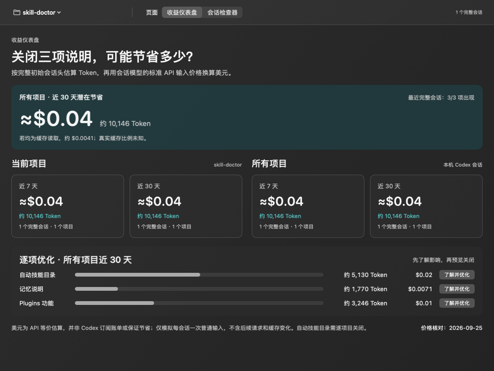
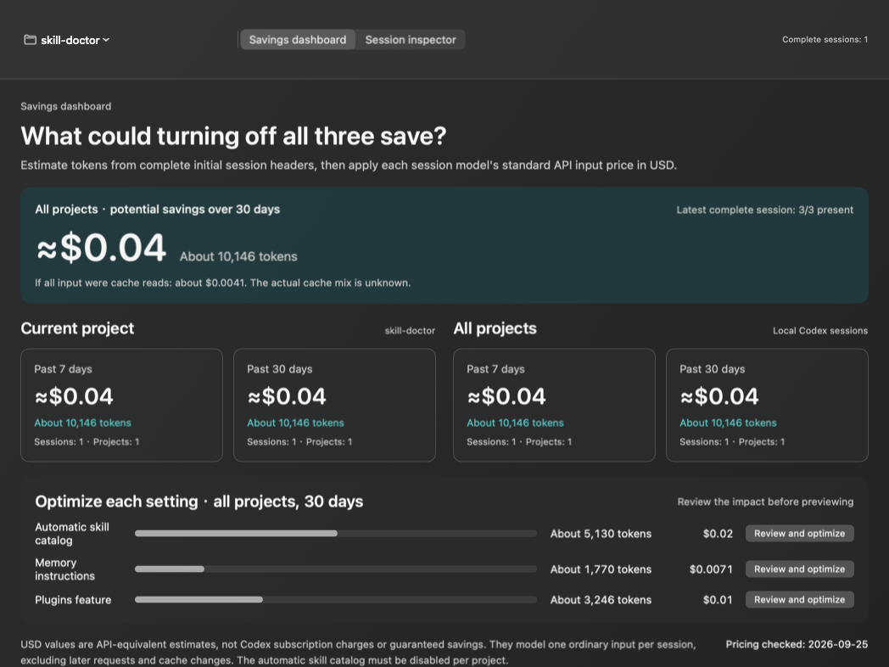
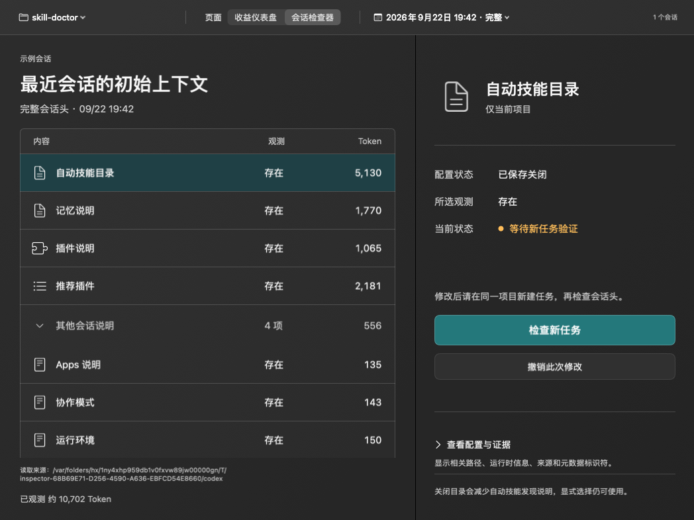

# Codex Context Bar

用 Swift 原生实现的 macOS 菜单栏应用，观察 Codex 初始会话头、预览配置修改，并从新任务日志验证结果。

提供可即时切换的简体中文与英文界面，语言选择保存在应用偏好中。SwiftUI + Foundation，无 Node、React、WebView 或常驻 HTTP 服务。TOML 校验使用固定版本的纯 Swift 库 TOMLDecoder。

## 运行

要求 macOS 14+、Swift 6.0+ / Xcode 16+。开发验证环境：Xcode 26.2、Swift 6.2.3、Apple Silicon。

```sh
swift test
./scripts/build-app.sh
open 'build/Codex Context Bar.app'
```

也可在 Xcode 打开 `Package.swift`。构建脚本生成本机架构的 `.app`，默认 ad-hoc 签名，仅用于本机开发；尚未提供 Developer ID 公证或自动更新。站外发布需要有效签名、公证和 Intel/Apple Silicon 兼容测试。

首次启动，在菜单栏点击图标 → 选择项目 → 打开收益仪表盘；可切换到会话检查器。主窗口工具栏或菜单栏面板中的地球图标可切换语言。默认读取 `~/.codex`，支持 `CODEX_HOME`（启动进程的环境变量）或在界面选择数据目录。Finder 启动不一定继承 shell 环境。

## 已实现

- 菜单栏摘要、独立详情窗口、项目和会话选择。
- 收益仪表盘汇总当前项目与所有项目近 7 天、30 天完整会话头中三项说明的估算 Token 和 API 等价美元潜在节省；美元优先展示，缺少受支持模型价格的会话单独提示。
- 三项说明各有“了解并优化”入口；先在浮窗查看关闭影响，再进入现有配置差异预览，保存后用新任务验证。
- 原生 JSONL 解析，基于 role 和 `content_item_kinds`，不会把正文引用的 block 标签当成真实注入。
- 完整性判断：ordinal 从零连续、无继承历史、有完整 world state、developer/user metadata 和首个 turn context。
- 自动技能目录（项目级）、Memory 与 Plugins（用户级）的配置预览、显式保存、撤销和新任务观察。
- 完整 TOML 校验、修改前指纹检查、原子替换、应用内跨进程锁；保留无关内容及目标行注释。
- 操作记录不保存配置全文或会话正文，只保存目标键原值、路径、时间和指纹。撤销恢复目标键，保留无关修改。
- 每分钟检查日志元数据，缓存未变化文件的解析结果；手动刷新。每次最多枚举 20,000 个条目，读取最近修改的 500 个日志及近 30 天内修改的日志，展示当前精确 cwd 的最近 30 个会话。达到上限明确提示。

## 使用闭环

1. 选择项目及一个完整会话头作为基线。
2. 点击“预览关闭”或“预览开启”，查看具体键、文件和影响范围。
3. 保存后显示待验证。已有会话中的继承历史不会被删除。
4. 在 **Codex Desktop 使用同一目录新建 local task**，不要用 fork 或另一个 worktree 代替。
5. 刷新或等待下一次检查；应用寻找修改后、同 cwd、同 source 的完整新会话头。
6. 在修改记录查看符合预期、不符合预期或证据不足。需要时撤销。

全局控制会影响其它项目的新会话。隐藏技能目录会减少自动技能发现说明；关闭 Plugins 会关闭插件功能，不只是推荐列表。Memory 开关不删除记忆文件。

## 证据与兼容边界

- 兼容依据是 2026-09-17—18 对 Desktop 内置 runtime `0.154.0-alpha.6.2` 的调查；新版需重新观察。
- Token 由会话头原文按 UTF-8 字节数除以 4 估算，参考 Skill Doctor 的近似四单位计数思路，并避免汉字按单字节估算。**不是精确 tokenizer 结果**；会话头不代表后续每次完整请求。
- 美元采用会话首个 `turn_context` 中可识别模型的 OpenAI 标准短上下文普通输入 API 价格，按每个完整会话只计一次。展示缓存读取价格作为敏感性参照；没有可靠缓存比例、模型价格或适用范围时不填零。价格核对日期：2026-09-25，[官方价格表](https://developers.openai.com/api/docs/pricing)。这不是 Codex 订阅账单或保证节省，也未模拟后续请求、缓存重建、输出变化和功能影响。
- 仪表盘只累计完整会话头中实际出现的自动技能目录、记忆说明、插件使用说明和推荐插件块；同一会话只计一次。不完整记录不按零计算。近 7/30 天按会话时间滚动统计，候选日志按文件修改时间读取；更早修改的文件、归档会话、扫描上限之外的记录可能遗漏。
- “新任务观测符合预期”只证明相关 metadata 在该新任务存在或缺席，不证明唯一因果，也不证明功能可用性。
- 日志 `source` 不能单独认证 Desktop 宿主链路。应用不创建任务、不抓取 WebSocket、不修改远程 feature flag。
- 缺少 metadata、fork、分页增量、截断和无法识别格式保持未知；绝不将未知当作零成本或已关闭。
- 配置层级、profile、managed requirements 和 Desktop 远程覆盖并未完整求值；配置写入结果始终与观测分离。
- 项目与 worktree 按真实 cwd 分开。归档会话暂不扫描。
- 推荐插件 block 独立关闭和项目层单技能禁用不作为可靠开关提供。
- TOML 点号键、inline table、目标 table 的特殊布局可能无法保留格式，应用会拒绝修改，允许用户手动处理。
- 新建的配置文件或空 table 在撤销后可能保留；撤销保证目标键恢复，不承诺逐字节还原整份文件。
- 检测到其它写入会拒绝过期操作；非合作程序在最后检查与 rename 之间写入的极短竞态无法完全消除。

## 本地数据

- 设置：应用 UserDefaults（项目目录、Codex 数据目录）。
- 操作记录：`~/Library/Application Support/CodexContextBar/operations/`，目录权限 0700、记录 0600。
- 配置写入仅在预览后点击“保存配置”时发生。应用运行时不联网、不上传、不读取登录凭据。
- 测试只使用临时目录和合成数据；仓库不包含真实会话、用户配置或令牌。

## 结构

```text
Sources/ContextCore/       会话模型、解析、扫描、TOML 编辑、操作与验证
Sources/CodexContextBar/   SwiftUI 菜单栏、详情与状态模型
Tests/ContextCoreTests/    合成日志与隔离文件系统回归测试
Resources/Info.plist       macOS 菜单栏应用元数据
scripts/build-app.sh       构建并本地签名 .app
```

后续重点：精确 Token 计量、文件事件驱动扫描、更多说明块的可控性、版本兼容样本，以及签名发布。

## 界面设计与验证

采用深石墨色收益仪表盘和双栏检查器：仪表盘以美元估算为主，并列展示两个范围、两个时间窗口及三项构成；检查器左侧选择会话内容，右侧分别呈现已保存配置、历史观测和新任务验证状态。菜单栏只汇总每个控制项最新一次操作；推荐插件保持只读观察。







图片来自实际 SwiftUI 视图与合成测试数据，不包含用户会话。33 项自动化测试覆盖核心逻辑与界面状态；可选原生布局快照：

```sh
CONTEXT_BAR_SNAPSHOT_DIR=/tmp/context-bar-snapshots swift test
```

设计对照与验证边界见 [design-qa.md](design-qa.md)。

## 磨砂玻璃外观

主窗口和菜单栏面板使用 macOS 原生背景模糊。点击工具栏或菜单栏面板底部的半圆图标，可实时调整背景透明度（0–85%，默认 65%），并自动保存到应用偏好设置。文字和按钮不随背景变透明。系统开启“减少透明度”时使用实色背景。

会话头读取在完整证据或明确不完整的判定点立即结束，避免继续扫描正文；分块读取只解析完整 JSON 行。刷新时工具栏显示加载状态。

默认选择最近的完整初始会话头，保留手动选择。继承或不完整记录展示原因及切换完整会话的入口；仅对已观测到的块显示部分数据，缺失内容保持未知。项目与会话名称固定展示在内容选择栏。

数据目录选择会检查 sessions 子目录，拒绝普通项目目录；空状态会显示读取来源和错误原因，并提供恢复默认目录入口。界面跟随系统明暗主题，高通透度仍保留可读底色。其他会话说明默认展开并展示估算 Token 合计。
