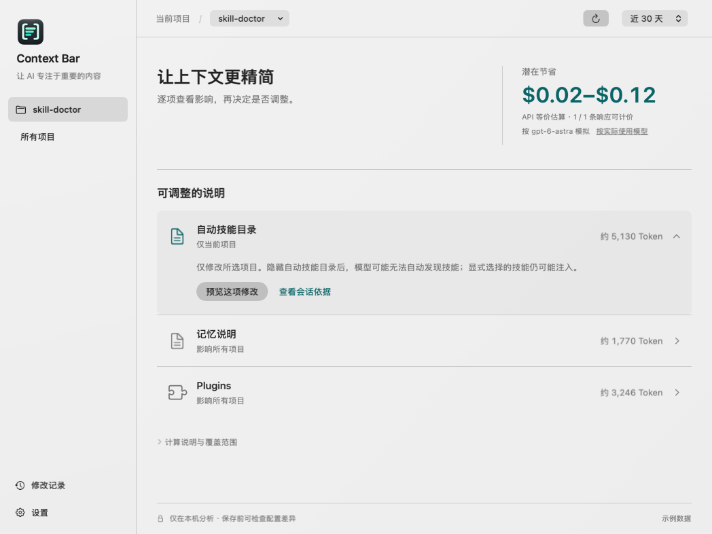
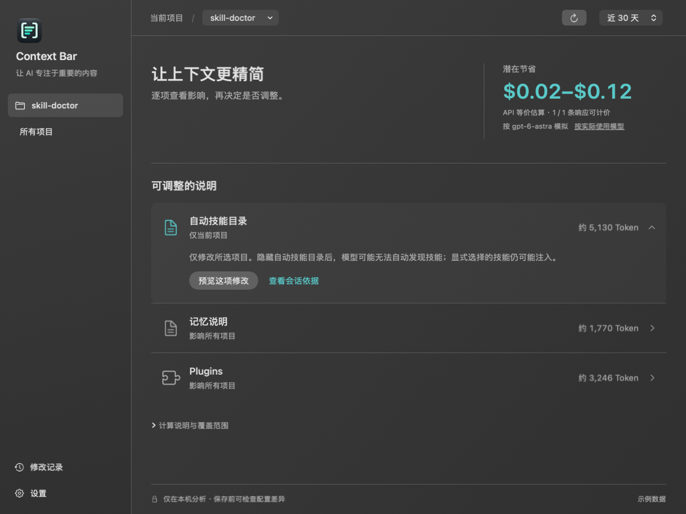

# Codex Context Bar

用 Swift 原生实现的 macOS 菜单栏应用，观察 Codex 初始会话头、预览配置修改，并从新任务日志验证结果。

提供可即时切换的简体中文与英文界面，语言选择保存在应用偏好中。SwiftUI + Foundation，无 Node、React、WebView 或常驻 HTTP 服务。TOML 校验使用固定版本的纯 Swift 库 TOMLDecoder。

## 运行

要求 macOS 14+、Swift 6.0+ / Xcode 16+。开发验证环境：Xcode 26.2、Swift 6.2.3、Apple Silicon。

```sh
swift test
./scripts/build-app.sh
open 'build/Codex Context Bar.app'
```

构建会自动将彩色 Logo 转换为 macOS 应用图标；菜单栏采用随系统明暗外观适配的 18pt 单色模板图。设计源文件见 [Resources/Branding](Resources/Branding/README.md)。

也可在 Xcode 打开 `Package.swift`。构建脚本生成本机架构的 `.app`，默认 ad-hoc 签名，仅用于本机开发；尚未提供 Developer ID 公证或自动更新。站外发布需要有效签名、公证和 Intel/Apple Silicon 兼容测试。

首次启动，在菜单栏点击图标 → 选择项目 → 打开项目概览。展开一项说明即可查看影响、预览修改；需要核对日志时点击“查看会话依据”。侧栏设置或菜单栏面板中的地球图标可切换语言。默认读取 `~/.codex`，支持 `CODEX_HOME`（启动进程的环境变量）或在界面选择数据目录。Finder 启动不一定继承 shell 环境。

## 已实现

- 菜单栏摘要、独立详情窗口、项目和会话选择。
- 收益仪表盘按响应时间汇总当前项目与所有项目近 7 天、30 天的用量；默认按最高价模型 gpt-6-astra 模拟历史费用与三项说明的累计潜在节省，展示计价响应覆盖数；金额下方的小号文字按钮可切换到各响应实际模型，所有项目、时间窗口与逐项金额同步切换。模式不写入偏好，新启动默认最高价。
- 三项说明在列表内展开影响，直接进入配置差异预览；保存后在原位置展示等待验证与检查新记录入口。菜单栏优先引导继续验证或检查异常。所有项目视图只汇总，修改需回到当前项目。
- 原生 JSONL 解析，基于 role 和 `content_item_kinds`，不会把正文引用的 block 标签当成真实注入。
- 完整性判断：ordinal 从零连续、无继承历史、有完整 world state、developer/user metadata 和首个 turn context。
- 自动技能目录（项目级）、Memory 与 Plugins（用户级）的配置预览、显式保存、撤销和新任务观察。
- 完整 TOML 校验、修改前指纹检查、原子替换、应用内跨进程锁；保留无关内容及目标行注释。
- 操作记录不保存配置全文或会话正文，只保存目标键原值、路径、时间和指纹。撤销恢复目标键，保留无关修改。
- 每分钟检查日志元数据，缓存未变化文件的解析结果；手动刷新。每次最多枚举 20,000 个条目，读取最近修改的 500 个日志及近 30 天内修改的日志，展示当前精确 cwd 的最近 30 个会话。达到上限明确提示。

## 使用闭环

1. 选择项目，应用优先使用完整会话头作为基线。
2. 展开一项说明，点击“预览这项修改”，查看具体键、文件和影响范围。
3. 保存后显示待验证。已有会话中的继承历史不会被删除。
4. 在 **Codex Desktop 使用同一目录新建 local task**，不要用 fork 或另一个 worktree 代替。
5. 刷新或等待下一次检查；应用寻找修改后、同 cwd、同 source 的完整新会话头。
6. 在原说明行或修改记录查看符合预期、不符合预期或证据不足。需要时撤销。

全局控制会影响其它项目的新会话。隐藏技能目录会减少自动技能发现说明；关闭 Plugins 会关闭插件功能，不只是推荐列表。Memory 开关不删除记忆文件。

## 证据与兼容边界

- 兼容依据是 2026-09-17—18 对 Desktop 内置 runtime `0.154.0-alpha.6.2` 的调查；新版需重新观察。
- Token 由会话头原文按 UTF-8 字节数除以 4 估算，参考 Skill Doctor 的近似四单位计数思路，并避免汉字按单字节估算。**不是精确 tokenizer 结果**；会话头不代表后续每次完整请求。
- 计算规则以 Skill Doctor 的《基于项目历史会话的费用计算逻辑》（2026-09-26）为依据。优先解析逐响应的 token_usage_record，按线程内 response_id 去重，通过 turn_id 关联模型；只统计日志所属线程，不叠加 turn/thread 累计值或关联子线程用量。六项用量字段全部有效才计价；不完整记录保留在覆盖分母中。没有正式记录时才使用 token_count 回退，回退始终不计价；只有累计值时仅保留最后一条。
- 普通输入 = 总输入 − 缓存读取 − 缓存写入；总费用 =（普通输入 × 普通单价 + 缓存读取 × 缓存单价 + 缓存写入 × 写入单价 + 输出 × 输出单价）/ 百万。推理输出不重复计费。实际模型按去空白、转小写后精确匹配；最高价口径固定采用参考表中普通输入单价最高的 gpt-6-astra。未知模型、非法分区和超过 200,000 输入 Token 的响应不套用价格；没有可计价响应显示未知，部分覆盖只显示已知金额。
- 内置价格照录参考文档的 2026-09-07 数据，未实时核验：astra 为 20 / 2 / 25 / 75，5.6-sol 为 8 / 0.8 / 10 / 30，5.6-terra 为 4 / 0.4 / 5 / 18，5.6-luna 为 0.4 / 0.04 / 0.5 / 1.8，5.3-codex 为 1.75 / 0.175 / 未定义 / 14（普通输入、缓存读取、缓存写入、输出，USD / 百万 Token）。参考文档未列出的模型不猜价格；保留其中 5.3-codex 有输入时因缺写入价格而总费用未知的边界。本产品不提供自定义阶梯价表。
- 节省按每条响应之前实际观测到的目标文本累计，默认统一使用 gpt-6-astra，点击“按实际使用模型”后改用该响应实际模型。两种口径分别计算金额与覆盖数，实际模型未知时不会回退到最高价。压缩、JSON 损坏、ordinal 断序和响应后的完整替换快照清除旧证据；文本明确重新出现后才恢复。目标 T 在总输入 I、缓存 C 中的缓存归属介于 max(0, T−(I−C)) 与 min(T,C)，据此求节省上下界。缓存写入非零或目标超出输入时不估算节省。总区间与参考页面一致，按目标、响应、会话累加上下界。覆盖数表示至少一个目标有可计价证据，不代表所有目标都完整。未知目标显示“—”，不按零计算。
- 所有金额都是 API 等价估算，不是订阅账单或保证节省。目标文本仍使用 UTF-8 字节数 / 4 的近似计数，尚未移植参考实现的 tokenizer；实际响应用量直接来自日志。未模拟缓存重建、输出变化与关闭功能的影响。
- 保留产品近 7/30 天滚动窗口，按响应时间过滤，跨窗口会话仅纳入窗口内响应；并非参考页面的本周/本月。按最近活动去重 session_id（缺失时用线程 id）。候选日志仍按文件修改时间读取，归档和扫描上限之外的记录可能遗漏。会话数包含窗口内有响应或新建的会话；完整初始会话头仅用于缺席证明与配置验证，不替代逐响应用量。
- “新任务观测符合预期”只证明相关 metadata 在该新任务存在或缺席，不证明唯一因果，也不证明功能可用性。
- 日志 `source` 不能单独认证 Desktop 宿主链路。应用不创建任务、不抓取 WebSocket、不修改远程 feature flag。
- 缺少 metadata、fork、分页增量、截断和无法识别格式保持未知；绝不将未知当作零成本或已关闭。
- 配置层级、profile、managed requirements 和 Desktop 远程覆盖并未完整求值；配置写入结果始终与观测分离。
- 项目与 worktree 按真实 cwd 分开。归档会话暂不扫描。
- 推荐插件 block 独立关闭和项目层单技能禁用不作为可靠开关提供。
- TOML 点号键、inline table、目标 table 的特殊布局可能无法保留格式，应用会拒绝修改，允许用户手动处理。
- 新建的配置文件或空 table 在撤销后可能保留；撤销保证目标键恢复，不承诺逐字节还原整份文件。
- 检测到其它写入会拒绝过期操作；非合作程序在最后检查与 rename 之间写入的极短竞态无法完全消除。

## 本地数据

- 设置：应用 UserDefaults（项目目录、Codex 数据目录）。
- 操作记录：`~/Library/Application Support/CodexContextBar/operations/`，目录权限 0700、记录 0600。
- 配置写入仅在预览后点击“保存并等待验证”时发生。应用运行时不联网、不上传、不读取登录凭据。
- 测试只使用临时目录和合成数据；仓库不包含真实会话、用户配置或令牌。

## 结构

```text
Sources/ContextCore/       会话模型、解析、扫描、TOML 编辑、操作与验证
Sources/CodexContextBar/   SwiftUI 菜单栏、详情与状态模型
Tests/ContextCoreTests/    合成日志与隔离文件系统回归测试
Resources/Info.plist       macOS 菜单栏应用元数据
scripts/build-app.sh       构建并本地签名 .app
```

后续重点：精确 Token 计量、文件事件驱动扫描、更多说明块的可控性、版本兼容样本，以及签名发布。

## 界面设计与验证

采用方案 1 的项目工作台布局：浅灰材质侧栏、系统字体、细分隔线与少量青绿色强调。当前项目 / 所有项目和近 7 / 30 天分别切换，每次只展示一组金额；计算说明按需展开。三项说明采用原位展开列表，配置影响、预览和验证连在同一路径中。详细会话检查器仍可从“查看会话依据”进入。界面跟随系统明暗主题。





图片来自实际 SwiftUI 视图与合成测试数据，不包含用户会话。自动化测试覆盖核心逻辑与界面状态；可选原生布局快照：

```sh
CONTEXT_BAR_SNAPSHOT_DIR=/tmp/context-bar-snapshots swift test
```

设计对照与验证边界见 [design-qa.md](design-qa.md)。

## 磨砂玻璃外观

主窗口、会话详情、设置和菜单栏面板使用 macOS 原生背景模糊，配合柔和透底与细微高光，形成接近 iOS 的磨砂玻璃质感。在侧栏“设置”中，在会话详情页右上角“更多 → 设置”中，或点击菜单栏面板底部的半圆图标，可实时调整背景透明度（0–85%，默认 65%），并自动保存到应用偏好设置。透明度调节直接控制玻璃底色，窗口后的内容由系统模糊处理；文字和按钮不随背景变透明。系统开启“减少透明度”时使用实色背景。

配置验证用的会话头读取在判定点立即结束；费用分析另外流式读取历史，只保留用量与目标 Token 计数，不保留正文。分块读取只解析完整 JSON 行，单行读取有内存上限。刷新时工具栏显示加载状态。

默认选择最近的完整初始会话头，保留手动选择。继承或不完整记录展示原因及切换完整会话的入口；仅对已观测到的块显示部分数据，缺失内容保持未知。项目与会话名称固定展示在内容选择栏。

数据目录选择会检查 sessions 子目录，拒绝普通项目目录；空状态会显示读取来源和错误原因，并提供恢复默认目录入口。界面跟随系统明暗主题，高通透度仍保留可读底色。其他会话说明默认展开并展示估算 Token 合计。
