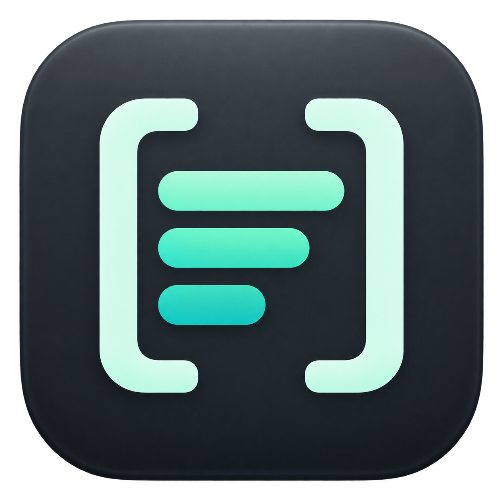
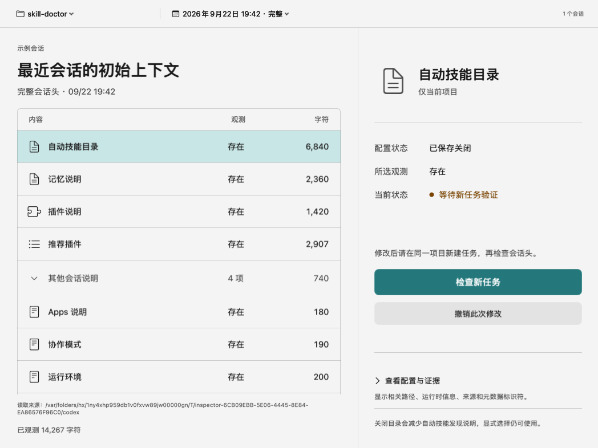

<p align="center">
  
</p>

# Codex Context Bar

**看清 Codex 的上下文，再决定如何精简。**

[English](README.en.md) · [使用与估算边界](docs/ESTIMATION.md) · [参与贡献](CONTRIBUTING.md)

一个专为 **Codex** 打造的原生 macOS 菜单栏工具：查看本机会话中的上下文说明、估算历史用量与潜在节省，预览配置修改，再通过新任务的日志检查结果。

独立社区项目，与 OpenAI 无隶属关系，也未获其背书。当前为早期版本，建议从源码构建并先阅读下方的兼容说明。


*截图使用合成示例数据；金额仅演示 API 等价估算，不是实际订阅账单。*

## 为什么做这个工具

Codex 会话中可能包含技能目录、记忆、插件以及项目说明。哪些内容被观测到了？它们的作用范围是什么？修改后，新任务是否真的发生变化？

Codex Context Bar 把这些信息放进一个本地工作流：**观察 → 预览 → 保存 → 新任务验证**。配置已保存和日志已验证分开展示，证据不足时明确保留为未知。

## 可以做什么

- **查看上下文构成**：检查自动技能目录、Memory、Plugins 与其他说明的存在状态和近似 Token 数。
- **回顾历史用量**：切换当前项目 / 所有项目，查看近 7 天或 30 天的统计及计价覆盖范围。
- **模拟潜在节省**：默认按内置参考表中的最高普通输入单价模型 `gpt-6-astra` 模拟；金额下方可切换到日志记录的实际模型口径。价格为静态参考数据，未实时核验。
- **先看差异，再改配置**：展示目标文件、键值与项目 / 用户级范围。保存后等待新任务证据，支持撤销本次目标键修改。
- **保持本地处理**：应用运行时不联网、不上传会话、不读取登录凭据；安装与构建会下载依赖。
- **原生 macOS 体验**：SwiftUI、菜单栏入口、中英双语、系统 / 浅色 / 深色主题、0–100% 磨砂玻璃透明度，默认 85%。

## 从源码运行

需要 macOS 14+、Swift 6.0+（Xcode 16+）。已在 Apple Silicon、Xcode 26.2 / Swift 6.2.3 上验证构建。构建脚本生成当前机器架构的应用；Intel 尚未完成验证。

```sh
git clone https://github.com/evilstar2016/codex-context-bar.git
cd codex-context-bar
swift test
./scripts/build-app.sh
open 'build/Codex Context Bar.app'
```

也可用 Xcode 打开 `Package.swift`。这是菜单栏应用，启动后从 macOS 菜单栏图标进入。

构建产物采用本地 ad-hoc 签名。目前没有 Developer ID 公证的发行包或自动更新功能。

## 第一次使用

1. 点击菜单栏图标，选择你在 Codex 中使用的项目目录。
2. 打开项目概览，展开一项说明，了解关闭后的影响。
3. 点击“预览这项修改”，检查文件、作用范围与配置差异。
4. 确认保存后，在 **Codex Desktop 的同一目录新建 local task**。
5. 回到工具检查新记录，查看是否观测到预期结果。需要时撤销。

验证需要修改后、同目录、同来源的完整新会话头。fork、另一个 worktree 或已有会话不能代替这一步。所有项目页面用于汇总，修改配置需回到具体项目。

默认读取 `~/.codex`；支持 `CODEX_HOME`，也可在设置中选择数据目录。通过 Finder 启动时不一定继承 shell 环境变量。

## 哪些开关会影响什么

| 项目 | 修改范围 | 关闭后的影响 |
| --- | --- | --- |
| 自动技能目录 | 当前项目 | 自动发现技能的说明减少，显式选中的技能仍可能注入 |
| Memory | 用户级，影响其他项目的新任务 | 停止注入记忆说明，不删除记忆文件 |
| Plugins | 用户级，影响其他项目的新任务 | 影响整个插件功能，并非只隐藏推荐列表 |

推荐插件说明保持只读，不提供独立关闭开关。配置可能被其他层级或宿主覆盖，因此“保存成功”不会直接标为“已生效”。

## 如何理解金额和 Token

**金额是 API 等价估算，不是订阅账单、实际扣费或保证节省。**

正式响应的用量来自日志；目标说明的 Token 按 UTF-8 字节数近似计数，并非精确 tokenizer。节省区间反映目标文本的缓存归属不确定性，未模拟缓存重建、输出变化和关闭功能的影响。未知模型或缺少有效证据时不会猜价格，也不会把未知当作零。

内置价表来自参考实现的 2026-09-07 数据，并非实时 OpenAI 官方报价。完整公式、覆盖规则、扫描上限与价格明细见 [费用估算与兼容边界](docs/ESTIMATION.md)。

## 隐私与兼容性

- 只在本机解析日志，不上传会话或配置。仅在预览后点击保存才写入目标配置。
- 操作记录位于 `~/Library/Application Support/CodexContextBar/operations/`，包含路径、目标键原值、时间和指纹，不保存完整配置或会话正文。
- 已有配置修改会被检测；撤销只恢复本次目标键，保留无关修改。
- 日志格式和控制项会随 Codex 版本变化。当前兼容依据来自对 runtime `0.154.0-alpha.6.2` 的调查，其他版本需重新观察。
- metadata 缺失、继承历史、截断或无法识别格式时，保留未知状态。完整会话头只能证明该任务的观测结果，不能证明每一次请求或唯一因果。
- 系统开启“减少透明度”时自动使用实色背景；100% 透明度仍保留系统模糊。

<details>
<summary>更多截图</summary>




</details>

## 开发与贡献

欢迎提交可复现的问题、兼容性样本、翻译和小范围改进。请使用合成或脱敏数据，**不要上传真实会话、密钥或个人配置**。

```sh
swift test
./scripts/build-app.sh
git diff --check
```

可选原生视图快照：

```sh
CONTEXT_BAR_SNAPSHOT_DIR=/tmp/context-bar-snapshots swift test
```

`Sources/ContextCore` 包含解析、估算与配置逻辑；`Sources/CodexContextBar` 包含原生界面。测试使用临时目录与合成日志。离屏截图可检查布局，不能证明桌面背景模糊或完整鼠标键盘交互。详见 [贡献指南](CONTRIBUTING.md) 和 [设计验证记录](design-qa.md)。

后续方向：精确 Token 计量、更多版本兼容样本、文件事件驱动扫描，以及签名公证发行。

## 致谢与许可证

计算逻辑参考 Skill Doctor 的历史会话费用分析方式。TOML 解析使用 [TOMLDecoder](https://github.com/dduan/TOMLDecoder)，第三方许可见 [THIRD_PARTY_NOTICES.md](THIRD_PARTY_NOTICES.md)。

本项目采用 [MIT 许可证](LICENSE)。
